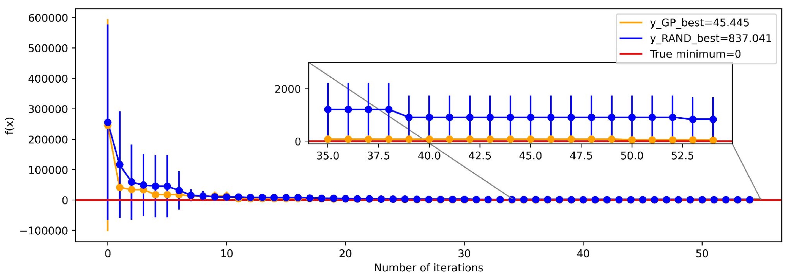

# Bayesian Optimization with Gaussian Processes for Hyperparameter Tuning

## Overview

This repository contains the implementation of the project developed for the course Information Theory and Inference (UniPD) focused on applying Bayesian optimization with Gaussian processes to find the minimum of analytical test functions and fine-tune hyperparameters in a Convolutional Neural Network (CNN). Additionally, Markov Chain Monte Carlo (MCMC) and point estimation with Maximum Likelihood are explored to find hyper-hyperparameters for the Gaussian process kernel.

## Project Components

1. **Bayesian Optimization with Gaussian Processes (BO-GP):**
   - The `functions_plot_BO` module includes the core implementation of Bayesian optimization using Gaussian processes. It provides a flexible framework for optimizing objective functions.

2. **Analytical Test Functions:**
   - The `plot_analitic_functions` notebook contains implementations of various analytical test functions. These functions serve as a benchmark to evaluate the performance of the Bayesian optimization algorithm.

3. **CNN Hyperparameter Tuning:**
   - The `Bayesian_Optimizer_s_l_plots` notebook demonstrates the application of Bayesian optimization to fine-tune hyperparameters in a Convolutional Neural Network. It includes configurations and results.

4. **Max Likelihood approach**
   - The `bo_maxlik` notebook contains the implementation of the Point estimation by minimizing the marginal likelihood
  
5. **MCMC for Hyper-Hyperparameter Optimization:**
   - The `Functions_MCMC_for_GP` module showcases the use of Markov Chain Monte Carlo to find hyper-hyperparameters governing the Gaussian process kernel. Results and plots are provided in this notebook `MCMC_for_GP.ipynb`.

## Test function result

    <figure>
        
        <figcaption> Comparison between random search and Gaussian process (fixed kernel parameters) for identifying the minimum of the Rosenbrock function.  </figcaption>
    </figure>

